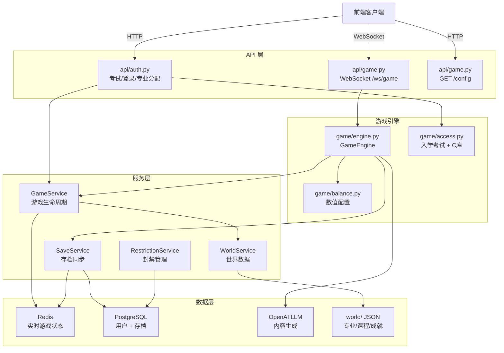
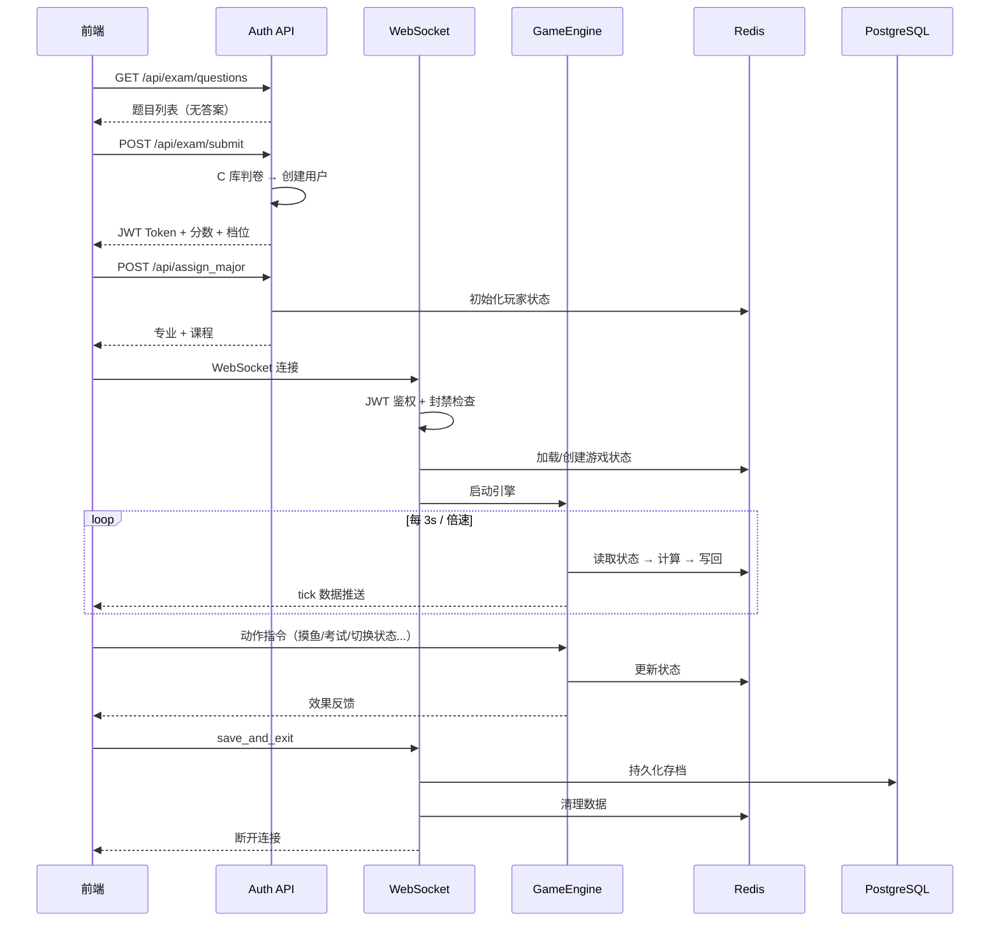

# ZJUers Simulator 后端项目结构与逻辑总览

> **项目概览**：一个基于 FastAPI + WebSocket + Redis + PostgreSQL 的**浙大校园模拟文字游戏**后端。玩家通过"入学考试"注册，被分配专业和课表，在 WebSocket 实时游戏引擎中体验大学 8 个学期（含考试、摸鱼、随机事件等），最终毕业并生成 AI 文言文总结。

---

## 目录结构

```
zjus-backend/app/
├── main.py                  # FastAPI 入口，路由注册、启动事件
├── admin.py                 # SQLAdmin 后台管理面板
├── api/
│   ├── auth.py              # 认证路由（考试/登录/专业分配）
│   ├── game.py              # WebSocket 游戏主入口 + 配置API
│   ├── deps.py              # FastAPI 依赖注入（DB/Redis/Services）
│   └── cache.py             # Redis 缓存工具类（全局连接池）
├── core/
│   ├── config.py            # Pydantic 全局配置（有安全检查）
│   ├── database.py          # Async SQLAlchemy 引擎 + 会话
│   ├── security.py          # JWT Token 创建
│   ├── events.py            # GameEvent Pydantic 模型
│   └── llm.py               # LLM 调用层（CC98/随机事件/钉钉/文言文）
├── models/
│   ├── user.py              # User 表
│   ├── game_save.py         # GameSave 表（存档）
│   └── admin.py             # UserRestriction / UserBlacklist / AdminAuditLog 表
├── schemas/
│   └── game_state.py        # PlayerStats / GameStateSnapshot（Redis 数据结构化）
├── repositories/
│   └── redis_repo.py        # RedisRepository 原子读写层
├── services/
│   ├── game_service.py      # 游戏生命周期编排
│   ├── save_service.py      # Redis ↔ PostgreSQL 持久化
│   ├── world_service.py     # 世界数据加载（专业/课程/成就 JSON）
│   └── restriction_service.py  # 封禁/黑名单查询
├── game/
│   ├── engine.py            # 🔥 核心游戏引擎（Tick 循环 + 动作处理）
│   ├── balance.py           # 游戏数值配置管理器（单例）
│   ├── state.py             # RedisState 轻量门面
│   └── access.py            # 入学考试判卷（含 C 动态库调用）
└── websockets/
    └── manager.py           # WebSocket 连接管理器 + 心跳检测
```

---

## 核心架构与数据流



---

## 各模块详解

### 1. 入口 & 启动 — [main.py](file:///d:/projects/ZJUers_simulator/zjus-backend/app/main.py)

- 创建 FastAPI 应用，注册 `auth.router`（`/api` 前缀）和 `game.router`
- 挂载 SQLAdmin 后台和 `/world` 静态资源
- **启动事件**：自动建表、清理 Redis 孤儿 Key、启动全局心跳检测任务

### 2. 认证流程 — [api/auth.py](file:///d:/projects/ZJUers_simulator/zjus-backend/app/api/auth.py)

| 端点 | 功能 |
|---|---|
| `GET /api/exam/questions` | 获取入学考试题目（剥离答案防作弊） |
| `POST /api/exam/submit` | 提交考试 → C 库判卷 → 创建/更新用户 → 返回 JWT |
| `POST /api/assign_major` | 考试通过后分配专业、初始化课程 |
| `GET /api/admission_info` | 获取当前用户入学信息 |
| `POST /api/exam/quick_login` | 老用户免考试快速登录 |

**认证机制**：JWT Token 包含 [sub](file:///d:/projects/ZJUers_simulator/zjus-backend/app/api/auth.py#54-127)(user_id)、`username`、[tier](file:///d:/projects/ZJUers_simulator/zjus-backend/app/game/access.py#100-114)，有效期 7 天。

### 3. WebSocket 游戏主循环 — [api/game.py](file:///d:/projects/ZJUers_simulator/zjus-backend/app/api/game.py)

连接生命周期分 4 个阶段：

1. **鉴权**：接受连接 → 10 秒内等待 `{token: "..."}` 消息 → 验证 JWT + 封禁检查
2. **注册连接**：踢掉旧连接（互斥策略，同用户只留一个 WS）
3. **初始化游戏**：通过 `GameService.prepare_game_context()` 恢复/创建游戏状态，启动 [GameEngine](file:///d:/projects/ZJUers_simulator/zjus-backend/app/game/engine.py#27-899) + 事件转发协程
4. **消息循环**：处理 `ping`、`save_and_exit`、`save_game`、`exit_without_save` 等指令，其余交给 `engine.process_action()`

### 4. 游戏引擎 — [game/engine.py](file:///d:/projects/ZJUers_simulator/zjus-backend/app/game/engine.py)（🔥 核心模块，899 行）

#### Tick 循环 ([run_loop](file:///d:/projects/ZJUers_simulator/zjus-backend/app/game/engine.py#202-341))
- 每 `3 / speed_multiplier` 秒执行一次 tick
- 每 tick 虚拟时间固定推进 3 秒（倍速只影响真实等待时间）
- **核心算法**：遍历每门课程，根据课程状态（摆/摸/卷）的系数计算：
  - **擅长度增长** = `基础增长 × 状态系数 × IQ 加成 × 心态压力修正`
  - **精力消耗** = `基础消耗 × 学分加权系数`
- 全摆烂（drain < 0.3）时反而回血 +2 精力、-2 压力
- 定期触发随机事件和钉钉消息（概率/频率均从 `balance` 配置读取）

#### 动作处理 ([process_action](file:///d:/projects/ZJUers_simulator/zjus-backend/app/game/engine.py#342-390))
| 动作 | 效果 |
|---|---|
| [pause](file:///d:/projects/ZJUers_simulator/zjus-backend/app/game/engine.py#50-54) / [resume](file:///d:/projects/ZJUers_simulator/zjus-backend/app/game/engine.py#41-49) | 暂停/恢复引擎 |
| `set_speed` | 设置倍速 (0.5x ~ 5.0x) |
| `change_course_state` | 切换课程状态（摆0/摸1/卷2） |
| [relax](file:///d:/projects/ZJUers_simulator/zjus-backend/app/game/balance.py#138-142) (gym/game/walk/cc98) | 各有不同的属性增减，cc98 会调用 LLM 生成帖子 |
| [exam](file:///d:/projects/ZJUers_simulator/zjus-backend/app/api/auth.py#54-127) | 期末考试 → GPA 结算 |
| [event_choice](file:///d:/projects/ZJUers_simulator/zjus-backend/app/game/engine.py#678-700) | 处理随机事件选择（白名单校验防作弊） |
| [next_semester](file:///d:/projects/ZJUers_simulator/zjus-backend/app/game/engine.py#780-821) | 进入下学期 / 毕业（>8 学期后触发毕业，生成文言文报告）|

#### Game Over 条件
- 心态 ([sanity](file:///d:/projects/ZJUers_simulator/zjus-backend/app/game/balance.py#182-186)) ≤ 0 → "心态崩了"
- 精力 ([energy](file:///d:/projects/ZJUers_simulator/zjus-backend/app/game/balance.py#69-73)) ≤ 0 → "精力耗尽"

### 5. 数值平衡 — [game/balance.py](file:///d:/projects/ZJUers_simulator/zjus-backend/app/game/balance.py)

单例 [GameBalance](file:///d:/projects/ZJUers_simulator/zjus-backend/app/game/balance.py#14-200)，从 `world/game_balance.json` 加载：
- Tick 参数（间隔、基础精力消耗、擅长度增长）
- 学期时长（按学期索引配置）、倍速模式
- 课程状态系数（摆/摸/卷的 growth 和 drain 系数）
- 心态/压力修正公式参数
- 摸鱼动作配置（冷却、效果数值）
- 事件触发频率、考试阈值、Game Over 配置

### 6. 入学考试 — [game/access.py](file:///d:/projects/ZJUers_simulator/zjus-backend/app/game/access.py)

- 从 `world/entrance_exam.json` 加载试卷
- **调用 C 动态库** (`libjudge.so` / `judge.dll`) 进行单题判分
- 分档：60 分及格，60-70 → TIER_4，70-80 → TIER_3，80-90 → TIER_2，90+ → TIER_1
- [get_questions_for_frontend()](file:///d:/projects/ZJUers_simulator/zjus-backend/app/game/access.py#182-197) 剥离答案后返回题目

### 7. LLM 内容生成 — [core/llm.py](file:///d:/projects/ZJUers_simulator/zjus-backend/app/core/llm.py)

使用 OpenAI API（可配置 base_url），支持用户自定义 LLM。**全部采用"批量进货+Redis 队列"模式**降低调用频次：

| 函数 | 用途 | 批量数 | 缓存 TTL |
|---|---|---|---|
| [generate_cc98_post](file:///d:/projects/ZJUers_simulator/zjus-backend/app/core/llm.py#62-156) | CC98 论坛帖子 | 5 条 | 6h |
| [generate_random_event](file:///d:/projects/ZJUers_simulator/zjus-backend/app/core/llm.py#158-244) | 校园随机事件 | 3 个 | 12h |
| [generate_dingtalk_message](file:///d:/projects/ZJUers_simulator/zjus-backend/app/core/llm.py#246-324) | 钉钉消息 | 5 条 | 6h |
| [generate_wenyan_report](file:///d:/projects/ZJUers_simulator/zjus-backend/app/core/llm.py#326-366) | 毕业文言文总结 | 1 条 | 不缓存 |

### 8. 数据层

#### Redis ([repositories/redis_repo.py](file:///d:/projects/ZJUers_simulator/zjus-backend/app/repositories/redis_repo.py) + [api/cache.py](file:///d:/projects/ZJUers_simulator/zjus-backend/app/api/cache.py))
每个玩家 7 个 Key（均带 TTL，默认 24h）：
- `player:{id}:stats` — Hash，核心属性
- `player:{id}:courses` — Hash，课程擅长度
- `player:{id}:course_states` — Hash，课程状态(0/1/2)
- `player:{id}:actions` — Hash，行为计数
- `player:{id}:achievements` — Set，已解锁成就
- `player:{id}:event_history` — List，近期事件标题（去重用）
- `player:{id}:cooldowns` — Hash，动作冷却时间戳

[RedisRepository](file:///d:/projects/ZJUers_simulator/zjus-backend/app/repositories/redis_repo.py#11-242) 提供原子操作：Lua 脚本安全更新（[update_stat_safe](file:///d:/projects/ZJUers_simulator/zjus-backend/app/repositories/redis_repo.py#191-207)）、Pipeline 批量操作。

#### PostgreSQL (`models/`)
- **users** — 用户基本信息 + 自定义 LLM 配置
- **game_saves** — 存档快照（JSON 字段），按 [(user_id, save_slot)](file:///d:/projects/ZJUers_simulator/zjus-backend/app/api/cache.py#90-94) 唯一约束
- **user_restrictions** — 封禁/冻结记录
- **user_blacklist** — 黑名单（支持 username/token/ip）
- **admin_audit_logs** — 管理操作审计日志

### 9. 服务层

| 服务 | 职责 |
|---|---|
| [GameService](file:///d:/projects/ZJUers_simulator/zjus-backend/app/services/game_service.py#15-253) | 游戏生命周期编排：初始化/恢复/分配专业/学期转换/坏档修复 |
| [SaveService](file:///d:/projects/ZJUers_simulator/zjus-backend/app/services/save_service.py#12-81) | Redis ↔ PostgreSQL 双向同步（upsert 策略） |
| [WorldService](file:///d:/projects/ZJUers_simulator/zjus-backend/app/services/world_service.py#12-91) | 加载 [world/](file:///d:/projects/ZJUers_simulator/zjus-backend/app/api/deps.py#56-59) 目录中的 JSON 数据（带异步缓存） |
| [RestrictionService](file:///d:/projects/ZJUers_simulator/zjus-backend/app/services/restriction_service.py#8-35) | 查询用户封禁状态和黑名单 |

### 10. 管理后台 — [admin.py](file:///d:/projects/ZJUers_simulator/zjus-backend/app/admin.py)

基于 SQLAdmin，提供 User / GameSave / Restriction / Blacklist / AuditLog 的 CRUD。
- 使用独立同步引擎（`psycopg2`）
- 登录验证使用 `secrets.compare_digest` 防计时攻击
- 所有修改/删除操作自动写审计日志

---

## 玩家完整生命周期

