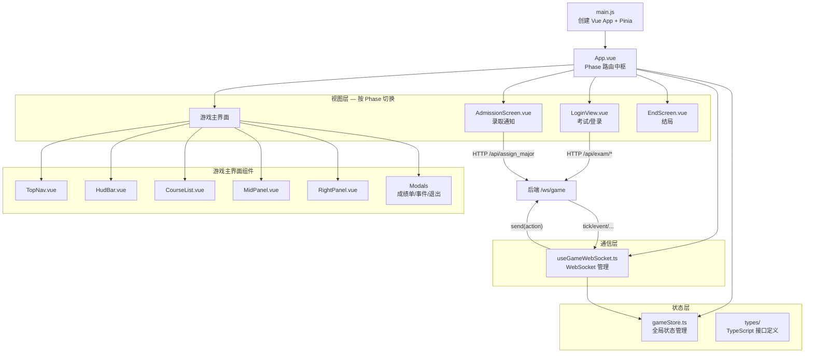
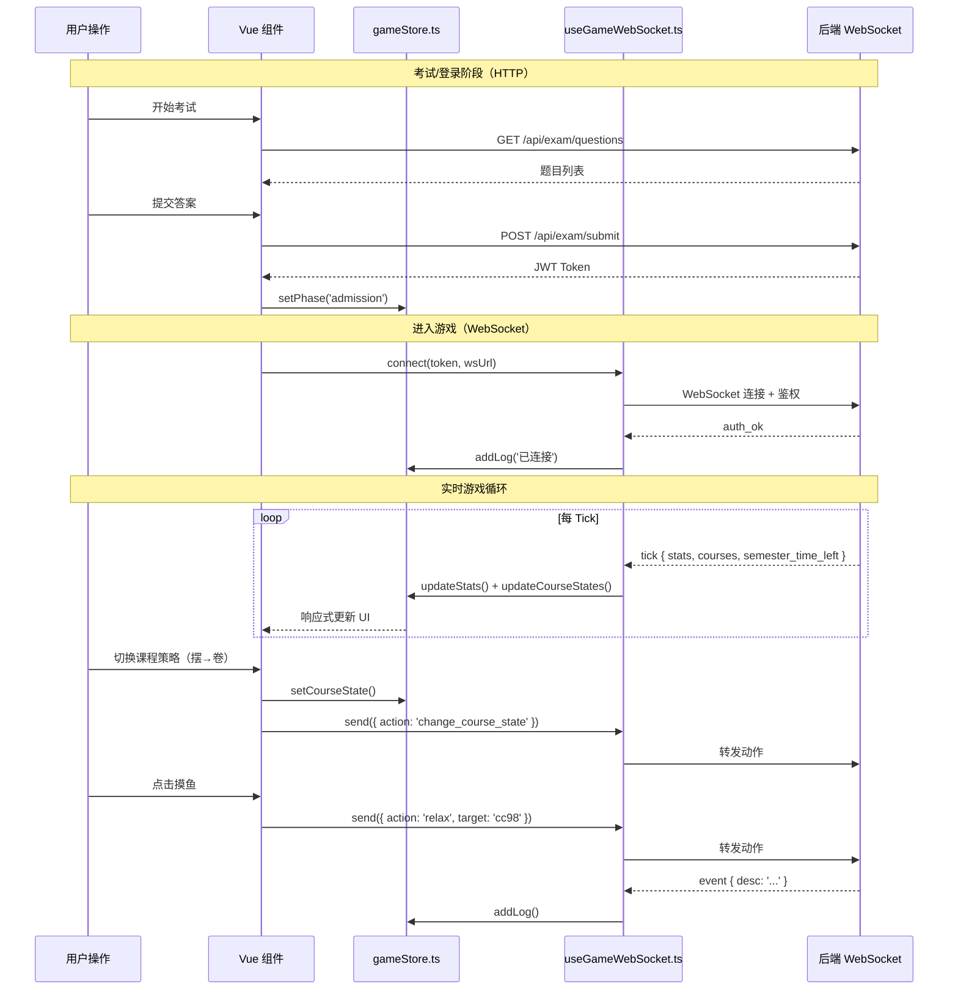

# ZJUers Simulator 前端项目结构与逻辑总览

> **项目概览**：基于 Vue 3 + Vite + Pinia 构建的单页应用 (SPA)。前端负责呈现入学考试、录取通知、实时游戏界面（课程管理、事件日志、属性面板）以及毕业结算等全部玩家交互。通过 WebSocket 与后端游戏引擎保持实时数据同步，采用渐进式 TypeScript 迁移策略。

---

## 目录结构

```
zjus-frontend/src/
├── main.js                  # 应用入口，挂载 Vue + Pinia
├── App.vue                  # 根组件，Phase 路由中枢 + 全局 Toast
├── style.css                # 全局样式
├── env.d.ts                 # TypeScript 模块声明（.vue shim）
├── types/                   # 📦 TypeScript 类型定义层
│   ├── index.ts             # Barrel export
│   ├── game.ts              # GamePhase, PlayerStats
│   ├── course.ts            # CoursesMap, CourseMetadata
│   ├── modal.ts             # TranscriptModalData, RandomEventModalData, DingTalkMessage
│   └── websocket.ts         # WsMessage(可辨识联合类型) + 解构工具函数
├── stores/
│   └── gameStore.ts         # 🔥 Pinia 全局状态中枢
├── composables/
│   └── useGameWebSocket.ts  # 🔥 WebSocket 连接管理 + 消息分发
├── components/
│   ├── LoginView.vue        # 入学考试 + 登录界面
│   ├── AdmissionScreen.vue  # 录取通知书 + 专业分配
│   ├── TopNav.vue           # 顶部导航（保存/退出）
│   ├── HudBar.vue           # HUD 状态栏（精力/心态/IQ/EQ/GPA）
│   ├── CourseList.vue        # 左栏：课程列表 + 策略切换（摆/摸/卷）
│   ├── MidPanel.vue         # 中栏：事件日志 + 钉钉消息
│   ├── RightPanel.vue       # 右栏：属性面板 + 摸鱼动作
│   ├── EndScreen.vue        # 结局界面（Game Over / 毕业）
│   └── modals/
│       ├── TranscriptModal.vue   # 期末成绩单弹窗
│       ├── RandomEventModal.vue  # 随机事件弹窗
│       └── ExitConfirmModal.vue  # 退出确认弹窗
└── assets/                  # 静态资源（由 Vite 处理）
```

---

## 核心架构



---

## 状态管理 — [gameStore.ts](file:///d:/projects/ZJUers_simulator/zjus-frontend/src/stores/gameStore.ts)

Pinia Composition API 风格的全局状态中枢，管理整个游戏的核心数据流。

### 核心状态

| 状态 | 类型 | 说明 |
|---|---|---|
| `currentPhase` | `ref<GamePhase>` | 当前阶段：`login` → `admission` → `loading` → `playing` → `ended` |
| `currentStats` | `reactive<PlayerStats>` | 玩家全部属性（energy/sanity/stress/iq/eq/gpa/efficiency 等） |
| `courseMetadata` | `ref<CourseMetadata[]>` | 静态课程信息（名称/学分） |
| `currentCourseStates` | `reactive<Record>` | 课程策略状态（0:摆 / 1:摸 / 2:卷） |
| `semesterTimeLeft` | `ref<number>` | 学期剩余秒数（后端 tick 推送） |
| `eventLogs` | `ref<EventLog[]>` | 事件日志（最多保留 50 条） |
| `dingMessages` | `ref<DingTalkMessage[]>` | 钉钉消息列表 |
| `activeModal` / `modalData` | `ref` | 当前激活的弹窗及其数据 |
| `endType` / `endData` | `ref` | 结局类型（game_over/graduation）和结局数据 |

### 关键方法

| 方法 | 作用 |
|---|---|
| `updateStats(newStats)` | 合并后端推送的属性（跳过 `courses` 字段防覆盖） |
| `updateCourseStates(updates)` | 响应式合并课程进度和策略 |
| `setCourseState(courseId, state)` | 本地立即切换课程策略 |
| `showModal(name, data)` | 打开弹窗（成绩单/随机事件/退出确认） |
| `triggerEndGame(type, data)` | 触发结局（暂停引擎 + 切换到 ended 阶段） |

---

## WebSocket 通信 — [useGameWebSocket.ts](file:///d:/projects/ZJUers_simulator/zjus-frontend/src/composables/useGameWebSocket.ts)

### 连接生命周期

1. **建立连接** → `ws://host/ws/game`
2. **发送鉴权** → `{ token, custom_llm_provider?, custom_llm_model?, custom_llm_api_key? }`
3. **收到 `auth_ok`** → 启动心跳（25s 间隔）→ 发送 `start` + `resume` + `get_state`
4. **消息循环** → 根据 `WsMessage` 可辨识联合类型分发到 Store
5. **断线重连** → 最多 3 次，间隔 3 秒

### 消息类型与处理

| 消息类型 | 处理逻辑 |
|---|---|
| `auth_ok` | 标记连接成功，启动心跳，请求初始状态 |
| `init` | 设置 Phase 为 playing，解析课程元数据，初始化属性 |
| `tick` | 更新属性、课程进度、学期倒计时（核心高频消息） |
| `state` | 全量状态同步（恢复游戏时使用） |
| `paused` / `resumed` | 切换暂停状态 |
| `event` | 追加事件日志 |
| `game_over` | 触发 Game Over 结局 |
| `semester_summary` | 打开成绩单弹窗 |
| `random_event` | 打开随机事件弹窗 |
| `dingtalk_message` | 追加钉钉消息 |
| `graduation` | 解构毕业数据（使用 `extractGraduationFinalStats` 工具函数），触发毕业结局 |
| `new_semester` | 清空课程/日志，显示新学期提示 |
| `save_result` | Toast 提示保存结果 |
| `exit_confirmed` | 清除 Token，刷新页面 |

---

## 类型系统 — `src/types/`

采用渐进式 TypeScript 迁移策略（`tsconfig.json` 中 `allowJs: true`），核心类型已抽离：

- **[game.ts](file:///d:/projects/ZJUers_simulator/zjus-frontend/src/types/game.ts)**：`GamePhase`（5 阶段枚举）、`PlayerStats`（与后端 `PlayerStats` Pydantic 模型对齐，包含索引签名兼容新增字段）
- **[course.ts](file:///d:/projects/ZJUers_simulator/zjus-frontend/src/types/course.ts)**：`CourseProgressUpdate`、`CoursesMap`、`CourseMetadata`
- **[modal.ts](file:///d:/projects/ZJUers_simulator/zjus-frontend/src/types/modal.ts)**：各弹窗数据结构（`TranscriptModalData`、`RandomEventModalData`、`DingTalkMessage`）
- **[websocket.ts](file:///d:/projects/ZJUers_simulator/zjus-frontend/src/types/websocket.ts)**：`WsMessage` 可辨识联合类型（涵盖全部 14 种消息），附带 `extractGraduationFinalStats` / `extractNewSemesterName` 解构工具函数

---

## 各组件详解

### [App.vue](file:///d:/projects/ZJUers_simulator/zjus-frontend/src/App.vue) — 根组件

- 根据 `currentPhase` 条件渲染不同视图（`v-if` / `v-else-if` 链）
- `onMounted` 时检查 `localStorage` 中的 Token 决定初始阶段
- `handleEnterGame(token)` 动态拼接 WebSocket URL（自动适配 `ws://` 和 `wss://`）
- 全局 Toast 提示渲染

### [LoginView.vue](file:///d:/projects/ZJUers_simulator/zjus-frontend/src/components/LoginView.vue) — 登录与考试

- 三种视图状态：`login`（登录表单） / `examStarted`（答题中） / `examFinished`（出分）
- HTTP API 调用：`GET /api/exam/questions`、`POST /api/exam/submit`、`POST /api/exam/quick_login`
- 支持自定义 LLM 配置（Provider/Model/API Key），通过 `sessionStorage` 传递

### [AdmissionScreen.vue](file:///d:/projects/ZJUers_simulator/zjus-frontend/src/components/AdmissionScreen.vue) — 录取通知

- 调用 `POST /api/assign_major` 分配专业
- 调用 `GET /api/admission_info` 获取入学信息
- 展示录取通知书动画，emit `enter-game` 事件进入 WebSocket 游戏

### 游戏主界面组件

| 组件 | 位置 | 职责 |
|---|---|---|
| [TopNav.vue](file:///d:/projects/ZJUers_simulator/zjus-frontend/src/components/TopNav.vue) | 顶部 | 保存游戏 / 退出按钮 |
| [HudBar.vue](file:///d:/projects/ZJUers_simulator/zjus-frontend/src/components/HudBar.vue) | 顶部下方 | 实时属性条（精力/心态/IQ/EQ/GPA），带 `safeNumber` 防御性渲染 |
| [CourseList.vue](file:///d:/projects/ZJUers_simulator/zjus-frontend/src/components/CourseList.vue) | 左栏 | 课程进度 + 策略切换按钮组（摆/摸/卷），通过 computed 缝合三方数据 |
| [MidPanel.vue](file:///d:/projects/ZJUers_simulator/zjus-frontend/src/components/MidPanel.vue) | 中栏 | 双 Tab：事件日志 + 钉钉消息，自动滚底 |
| [RightPanel.vue](file:///d:/projects/ZJUers_simulator/zjus-frontend/src/components/RightPanel.vue) | 右栏 | 效率/运气/声望面板 + 摸鱼动作按钮（健身/游戏/散步/CC98）+ 倍速/暂停控制 |

### 弹窗组件 (`modals/`)

| 组件 | 触发条件 | 功能 |
|---|---|---|
| [TranscriptModal.vue](file:///d:/projects/ZJUers_simulator/zjus-frontend/src/components/modals/TranscriptModal.vue) | `semester_summary` 消息 | 期末成绩单，展示各科分数/绩点，点击进入下学期 |
| [RandomEventModal.vue](file:///d:/projects/ZJUers_simulator/zjus-frontend/src/components/modals/RandomEventModal.vue) | `random_event` 消息 | 随机事件选择，emit 选择结果给后端 |
| [ExitConfirmModal.vue](file:///d:/projects/ZJUers_simulator/zjus-frontend/src/components/modals/ExitConfirmModal.vue) | 用户点击退出 | 确认保存并退出 / 不保存退出 |

---

## 数据流示意



---

## 构建与开发工具链

| 工具 | 配置文件 | 用途 |
|---|---|---|
| Vite | `vite.config.js` | 构建 + 开发服务器（端口 3000），代理 `/api`、`/ws`、`/world` 到后端 8000 |
| TypeScript | `tsconfig.json` | `allowJs: true` 渐进式迁移，`strict: true` |
| ESLint | `eslint.config.js` | Flat Config，覆盖 `.vue/.js/.ts` |
| Vitest | `vitest.config.js` | `jsdom` 环境，`globals: true` |
| vue-tsc | `npm run type-check` | Vue SFC 类型检查 |

### NPM Scripts

```bash
npm run dev        # 启动开发服务器 (localhost:3000)
npm run build      # 生产构建
npm run lint       # ESLint 检查 + 自动修复
npm run type-check # TypeScript 类型检查
npm test           # 运行 Vitest 测试
```
